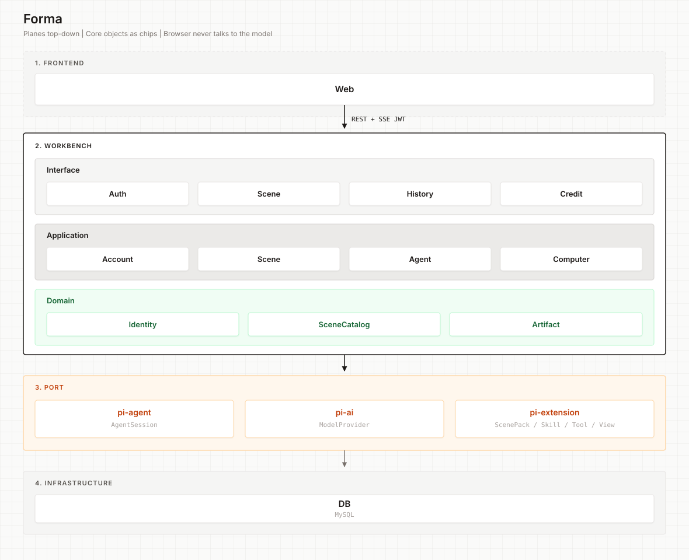
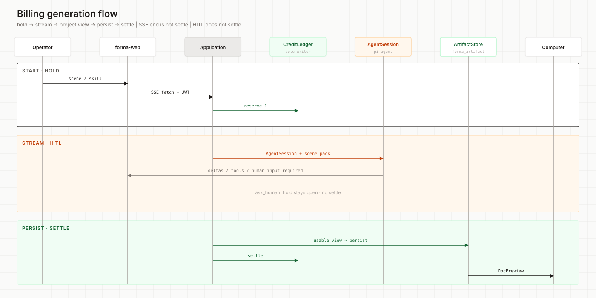

# Forma

**English** · [简体中文](README.zh-CN.md)

https://github.com/user-attachments/assets/cc93e364-aab7-44cf-a837-154b0f841f07

**Forma** is a personal assistant: it turns skills from daily work into jobs an agent can finish. A kind of job is a **scene**; how that job is done is a **Skill**. Pick a scene, run the agent, review the shaped result in Computer.

```text
Daily skills → Scene / Skill → Agent → usable result in Computer
```

## Why


### Customer pain

Day-to-day work runs on skills people already have: how to judge, in what order to act, and what “done” looks like. Those skills live in someone’s head or a notes app. Every time, the person still has to do the work. General-purpose AI will talk it through. It can’t pick up that way of working, or hand back the result they would normally ship.

The snag is usually one of three.

**Skills don’t travel.** The person can do the job; the system can’t. Another computer, another teammate, another week — the same work starts from scratch.

**The agent can’t take the job.** Until daily skills are written as steps and standards an agent can run, it can only answer in general. It doesn’t finish the actual piece of work on the desk.

**Handoff is still manual.** What they need is a shaped deliverable, not a conversation. After the chat they still tidy, reformat, and rewrite.

### What Forma does

Forma packs daily skills into scenes and Skills. Users pick a scene, run it, the agent completes the work with that skill, and the person reviews, edits, and takes the result in Computer.

The user still decides. The product’s job is to capture the skill, let the agent run it, and return the result the way that job should look. E-commerce listing and Xiaohongshu seeding are the first skills packed in; the same pattern can take more daily skills later.

### Who it’s for

- People who want the work they already know how to do to become something an agent can finish, repeatedly
- Solo operators and small teams who want one kind of work to run the same way every time
- People who can judge a result and don’t want to start from a blank page and a new prompt each time

Not a fit if you only want to chat, and don’t mean to hand a skill to an agent.

## Table of contents

- [Features](#features)
- [Quick start](#quick-start)
- [Architecture](#architecture)
- [Domain model](#domain-model)
- [Configuration](#configuration)
- [Development](#development)
- [Docs](#docs)
- [Status](#status)
- [Contact](#contact)


## Features

- Operator auth (register / login JWT) and account settings
- Scene gallery with five category tabs (tech / e-commerce / content / sports / life); `AVAILABLE` + `COMING_SOON` grey cards; shared credits
- Scene workspaces: e-commerce (picklist → listing) and Xiaohongshu (topics → note / break)
- Pi agent runs with billed hold; SSE via `fetch` + JWT (not raw `EventSource`)
- Computer DocPreview: GitHub-README style HTML, Forma view grammar (`.forma-*`, `data-forma-*`)
- Skill view Mustache templates under scene packs; settle only after usable `view` persists
- Credit tiers (FREE / PRO / PLUS), monthly reset, admin tier change whitelist
- Compose stack: MySQL + starter
- Stub model provider when API keys are empty (shape unchanged)


## Quick start


### Prerequisites


| Dependency         | Used for                                    |
| ------------------ | ------------------------------------------- |
| JDK 8 + Maven 3.8+ | Backend (`forma-starter`)                   |
| Node 20+ / npm     | Frontend (`forma-web`)                      |
| Docker Compose     | MySQL + starter image (optional all-in-one) |


Default ports:

- `3306` MySQL
- `8080` API (starter)
- `5173` Vite dev (web)


### 1. Environment

```bash
cp APP-META/docker-config/environment/.env.example APP-META/docker-config/environment/.env
# Edit JWT_SECRET (≥32 bytes). Leave model keys empty for local stub.
```


### 2. Backend

```bash
set -a && . APP-META/docker-config/environment/.env && set +a
mvn -pl forma-starter -am -DskipTests compile
mvn -pl forma-starter -am spring-boot:run
```


### 3. Frontend

```bash
cd forma-web
npm install
npm run dev
```

Open `http://127.0.0.1:5173` (or `/welcome` for the landing shell).

### 4. Docker (starter + MySQL)

```bash
cp APP-META/docker-config/environment/.env.example APP-META/docker-config/.env
./APP-META/bootstrap/build.sh
docker compose -f APP-META/docker-config/docker-compose.yml up -d --build
```

If Hub / mirrors 401 on the Java base image:

```bash
export STARTER_BASE_IMAGE=<local-java8-image>
export DOCKER_BUILDKIT=0 COMPOSE_DOCKER_CLI_BUILD=0
docker compose -f APP-META/docker-config/docker-compose.yml up -d --build
```

Tear down:

```bash
docker compose -f APP-META/docker-config/docker-compose.yml down
```

**Secrets** (JWT, model keys) stay in env / `.env` — never commit real values.

Local MySQL / `dev` profile writes `DATETIME` in **Asia/Shanghai** by default (`MYSQL_TZ` + `DB_SERVER_TIMEZONE`). Production still treats storage as UTC at the architecture level. Changing TZ requires restarting MySQL; **old rows are not rewritten**.

### 5. Smoke path

1. Register / login → open **场景**
2. Enter **电商开店** or **小红书种草**
3. Run a skill (picklist / listing / topics / note)
4. Confirm Computer shows a projected document; credits settle only after artifact persist


## Architecture


| Package                     | Path                                                    | Role                                                    |
| --------------------------- | ------------------------------------------------------- | ------------------------------------------------------- |
| Web                         | `forma-web/`                                            | Vue 3 + Vite SPA (not a Maven module)                   |
| Starter                     | `forma-starter/`                                        | Spring Boot entry                                       |
| Application                 | `forma-application/`                                    | Use cases, agent billing, Computer projectors           |
| Domain / Infra / Interfaces | `forma-domain/` · `…-infrastructure/` · `…-interfaces/` | DDD slices                                              |
| Pi extension                | `forma-pi-extension/`                                   | Scene packs, tools, Mustache views (`spring.factories`) |
| Pi runtime                  | `pi-ai/` · `pi-agent/`                                  | Agent                                                   |
| Ops                         | `APP-META/`                                             | Compose, Dockerfile, bootstrap SQL                      |


### Layered design

Business modules follow **Interface → Application → Domain ← Infrastructure**. Credits only mutate through **CreditLedger**. Agent tools must not write the ledger. Usable outcome = projectable Computer `view`, then persist → settle (see Architecture Spine AD-4 / AD-7).

Planes top-down (Callers → Workbench → Ports → Storage):




| Layer          | Owns                                                         | Must not                                      |
| -------------- | ------------------------------------------------------------ | --------------------------------------------- |
| Interface      | REST / SSE shapes, JWT `userId`                              | Business rules, SQL, model keys               |
| Application    | Billing hold, AgentSession, persist, settle, Computer project | Writing credits outside CreditLedger          |
| Domain         | Identity, CreditLedger, SceneCatalog, Artifact, Feedback     | Framework / HTTP                              |
| Pi extension   | Scene packs, tool handlers, Mustache `view`                  | Ledger writes                                 |
| Pi runtime     | Agent loop, tools, model I/O                                 | Product policy, credits                       |
| Infrastructure | MyBatis, JWT, MediaStore                                     | Second credit book or second artifact truth   |


Invariant source of truth:  
`[ARCHITECTURE-SPINE.md](sdd/planning-artifacts/architecture/architecture-lippi-ai-ebusiness-2026-09-26/ARCHITECTURE-SPINE.md)`

### Billing generation flow

Hold 1 credit → stream the agent → project a Computer `view` → persist artifact → **then** settle. SSE ending is not a settle point. HITL (`ask_human`) holds the run without settling.



Bootstrap SQL (fresh MySQL volume): `APP-META/bootstrap/sql/001_schema.sql` + `002_seed_scene.sql`. Recreate the volume to pick up schema changes (`docker compose … down -v`).

### Layout

```text
forma/
├── forma-starter/          # Boot entry
├── forma-application/      # Application services
├── forma-domain/
├── forma-infrastructure/
├── forma-interfaces/
├── forma-pi-extension/     # Scenes · tools · templates
├── pi-ai/ · pi-agent/      # Pi runtime
├── forma-web/              # Vue SPA
├── APP-META/               # Compose · SQL · bootstrap
├── sdd/                    # PRD · UX · Spine · context
└── AGENTS.md               # Short handbook for coding agents
```


## Domain model


| Term                 | Meaning                                                                |
| -------------------- | ---------------------------------------------------------------------- |
| Forma                | Product name — scene-shaped Skills, blank → finished work              |
| Scene / SceneCatalog | Gallery row (`sceneCode`, `AVAILABLE` / `COMING_SOON`)                 |
| SceneCapabilityPack  | Code resources: prompts + skill/tool allowlist for a scene             |
| Skill                | Runnable playbook inside a pack (e.g. picklist, xhs-note)              |
| AgentSession         | Chat/session orchestration via Pi                                      |
| GenerationRun        | One billed wave (hold + artifact ref + skill id)                       |
| Computer / view      | Projected document shown in DocPreview                                 |
| CreditLedger         | Sole writer of balances, holds, settle, monthly reset                  |
| MediaObject          | Image bytes in object store; listings use `mediaObjectId` when present |


## Configuration


| Variable                                 | Used by           | Notes                                       |
| ---------------------------------------- | ----------------- | ------------------------------------------- |
| `JWT_SECRET` / `JWT_EXPIRATION_MS`       | API               | HS256; secret ≥ 32 bytes                    |
| `MYSQL_*` / `DB_*`                       | API + Compose     | See `.env.example`                          |
| `MYSQL_TZ` / `DB_SERVER_TIMEZONE`        | MySQL / JDBC      | Local default `Asia/Shanghai`               |
| `DEEPSEEK_API_KEY` / `DASHSCOPE_API_KEY` | Pi                | Empty → stub provider                       |
| `CREDIT_ADMIN_USER_IDS`                  | Admin tier change | Comma-separated user UUIDs; empty → all 403 |
| `STARTER_BASE_IMAGE`                     | Compose           | Override when Hub pull fails                |


Full comments: `[APP-META/docker-config/environment/.env.example](APP-META/docker-config/environment/.env.example)`.

## Development

```bash
# Backend
mvn -pl forma-starter -am -DskipTests compile
mvn -pl forma-starter -am test

# Frontend
cd forma-web && npm run lint && npm run build
cd forma-web && npm test -- --run
```

Prefer repo scripts / Compose; do not invent ad-hoc commands. Coding style slices: `[sdd/context/](sdd/context/)` (open one of `02-be` / `03-fe` / `04-quality`). Agent-oriented short map: `[AGENTS.md](AGENTS.md)`.

## Docs


| Doc                                                                                                                                     | Purpose                                             |
| --------------------------------------------------------------------------------------------------------------------------------------- | --------------------------------------------------- |
| [AGENTS.md](AGENTS.md)                                                                                                                  | Commands, boundaries, where to start                |
| [Architecture Spine (2026-09-26)](sdd/planning-artifacts/architecture/architecture-lippi-ai-ebusiness-2026-09-26/ARCHITECTURE-SPINE.md) | Invariants                                          |
| [sdd/context/](sdd/context/)                                                                                                            | BE / FE / quality coding slices                     |
| [sdd/planning-artifacts/](sdd/planning-artifacts/)                                                                                      | PRD · UX · architecture                             |
| [docs/superpowers/](docs/superpowers/)                                                                                                  | Feature specs & plans (Computer, Mustache views, …) |


## Status

**In product use (local / near-term):** Auth, credits, scene gallery, e-commerce + Xiaohongshu + tech digest (科技速读) workspaces, billed agent runs, Computer DocPreview (Forma view protocol), history, account settings, Compose bootstrap.

**Deferred / grey cards:** Gear compare (sports), short-video commerce, weekend trip (life / outing) — `COMING_SOON` until packs + gates open. Scene roadmap: `sdd/planning-artifacts/scene-product-plan-2026-10-04.md`.

## Contact

Questions or feedback: [xiaoyan.wjw@gmail.com](mailto:xiaoyan.wjw@gmail.com)
