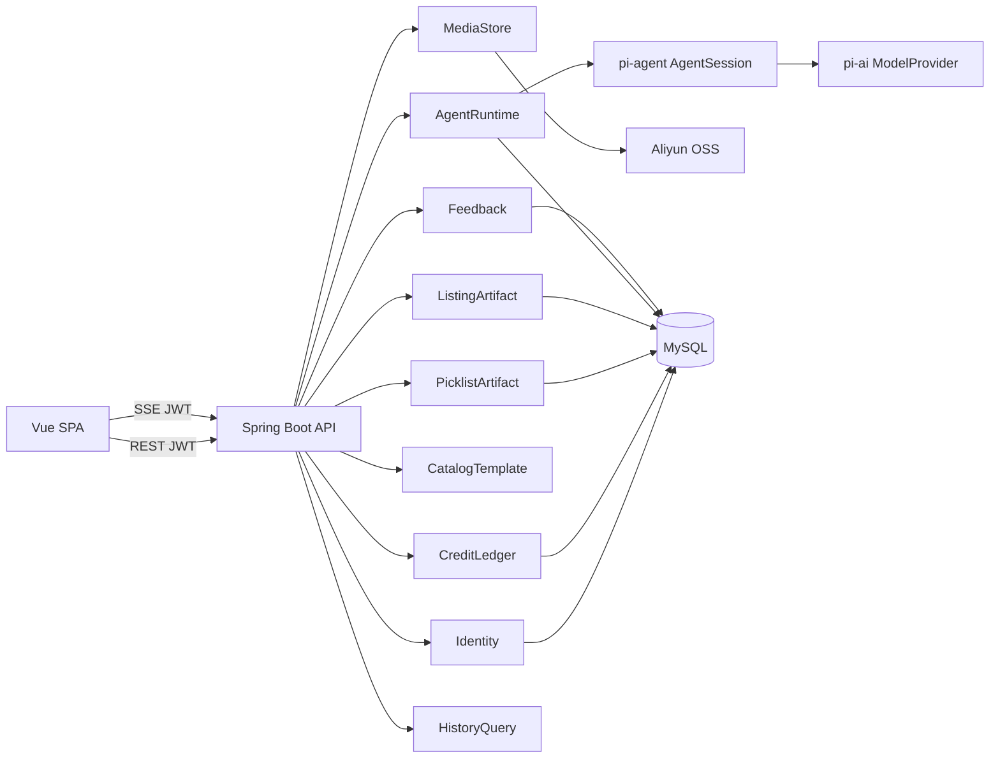
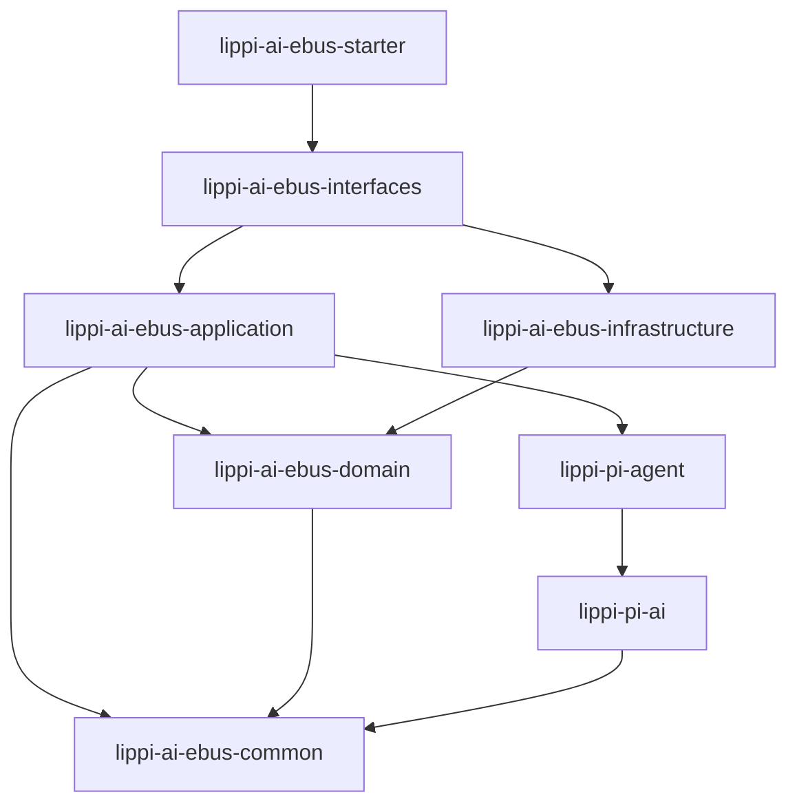
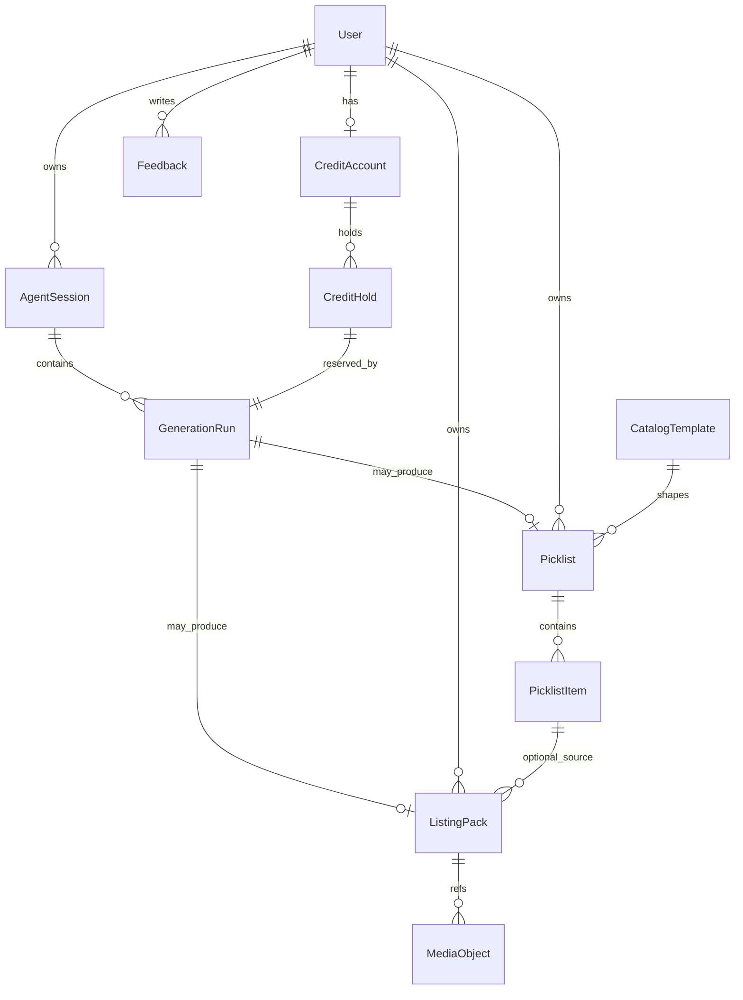

# Architecture Spine — lippi-ai-ebusiness

## Design Paradigm

**SPA + API 模块化单体（流式 Agent）**

- **Web（Vue SPA）**：展示、对话、预览；不拥有积分账本、不直连大模型。
- **Backend（Spring Boot 单部署单元）**：账号、积分、Agent 会话/SSE、选品/Listing 成果、OSS；内部按所有权分包，**不**拆微服务。
- **Agent 运行时**：vendor-copy 自 LIMS 的 `pi-ai` + `pi-agent`（门面 `AgentSession`）；模型调用只走 `pi-ai` 端口。
- **传输**：计费生成路径用 **SSE** 推送 Agent 事件；其余用 REST。



## Invariants & Rules

### AD-1 — 客户端与后台边界 [ADOPTED]

- **Binds:** all
- **Prevents:** 前端直连模型 / 自改积分 / 与后台抢写成果
- **Rule:** 浏览器只调本系统后端 REST/SSE；积分与模型调用不得出现在前端密钥或直连厂商 SDK 中。

### AD-2 — 后端形态：模块化单体 [ADOPTED]

- **Binds:** backend
- **Prevents:** v1 微服务拆分导致重复账本/会话
- **Rule:** 一个可部署的 Spring Boot 应用；领域按所有权模块划分，进程内调用。禁止为 v1 单独部署「积分服务」「Agent 服务」。

### AD-3 — Pi 运行时来源：vendor-copy [ADOPTED]

- **Binds:** AgentRuntime, model I/O
- **Prevents:** 同时维护 TS Pi 与 Java Pi；或运行时 Maven 依赖 LIMS 发版
- **Rule:** 将 LIMS 的 `lippi-ai-lims-pi-ai` / `lippi-ai-lims-pi-agent` **拷贝入本仓库**，目录与 artifact 命名为 **`lippi-pi-ai`** / **`lippi-pi-agent`**，并本地演进；v1 不依赖 LIMS 构件。所有模型调用经拷贝后的 `pi-ai` 端口；业务入口用 `AgentSession`，不把内部 `Agent` 类当对外 API。

### AD-4 — 计费生成用 SSE [ADOPTED]

- **Binds:** UJ-1, UJ-2, FR-7, FR-9, AgentRuntime
- **Prevents:** 同步长请求超时 vs 轮询任务两套客户端协议并存
- **Rule:** 选品清单 / Listing 套装的生成回合经 SSE 流式下发。浏览器用 **fetch + ReadableStream**（带 `Authorization`），不用原生 `EventSource`。闭合事件类型名（payload 细表可后钉）：`run_started` | `message_delta` | `tool_started` | `tool_finished` | `artifact_ready` | `run_failed` | `run_settled`。禁止另造同义事件名。

### AD-5 — 积分唯一写入者与预占结算 [ADOPTED]

- **Binds:** FR-3..FR-6, CreditLedger, NFR-2
- **Prevents:** 工具/前端直接改余额；失败仍扣分；并发双花；「SSE 结束」误当结算点
- **Rule:** 仅 **CreditLedger** 可变余额。套餐月额度：**免费 20 / Pro 200 / Plus 600**；月重置时剩余 **清零不结转**。计费：`检查 → 预占 1 → 仅当可用成果已持久化后结算 → 否则释放预占`。**禁止**仅因 SSE `agent_end`/流结束而结算。Agent 工具不得写积分表。

### AD-6 — 领域所有权 [ADOPTED]

- **Binds:** all backend modules
- **Prevents:** 两模块共写同一实体；会话层兼写业务成果；主图身份双真相
- **Rule:** 唯一写者如下。跨界只通过对方公开服务/端口。

| 所有者 | 写入范围 |
| --- | --- |
| Identity | 用户账号、凭证校验、JWT 签发/吊销 |
| CreditLedger | 余额、预占、结算、月重置、套餐档 |
| AgentRuntime | Agent 会话、`GenerationRun`（关联 holdId + sessionId + artifact 引用）、SSE 推送、`AgentSession` 编排 |
| CatalogTemplate | 品类模板；**全部已上线模板对三档套餐均可用**（不按套餐解锁） |
| PicklistArtifact | 选品清单及候选理由；每份清单必有 `templateId` |
| ListingArtifact | Listing 文案/展示说明；可选 `picklistItemId`；主图只存 `mediaObjectId[]`（不发明第二套 URL 真相） |
| MediaStore | OSS `objectKey`、字节、派生可读 URL |
| Feedback | FR-11「质量差」等简短反馈记录 |
| HistoryQuery | 无独立写模型；只读聚合本人近期成果 |

### AD-7 — 可用成果与 GenerationRun [ADOPTED]

- **Binds:** FR-3, FR-7, FR-9, FR-11, PicklistArtifact, ListingArtifact, AgentRuntime
- **Prevents:** 成果定义分叉；重试会话/预占错绑；选品→Listing 交接形状冲突
- **Rule:**
  - 选品成功：持久化约 8–12 条带理由候选，必含 `templateId`，并挂到当前 `GenerationRun.artifactRef`。
  - Listing 成功：持久化文案/展示说明 + ≥1 个 `mediaObjectId`；可带 `picklistItemId`（自填商品则可空）。
  - 每次计费生成（含重试）= **新的 `GenerationRun` + 新预占**；可复用同一聊天 `AgentSession`，但不得复用旧 hold。
  - 达成功条件后由 application 调 CreditLedger 结算，再发 SSE `artifact_ready` / `run_settled`。
  - 历史：**每次成功成果均保留为独立记录**（重试不覆盖、不自动 superseded）；用户删除另议。

### AD-8 — 认证与轻量防刷 [ADOPTED]

- **Binds:** FR-1, FR-2, NFR-5
- **Prevents:** 匿名消耗积分；短信/微信阻塞 v1；频率限制无处安放
- **Rule:** v1 为用户名或邮箱 + 密码；API 与 SSE 使用 `Authorization: Bearer <JWT>`。未认证不得启动计费生成。异常频率限制落在 **interfaces** 层（按用户/IP），与 Identity 协作；微信 OAuth / 手机验证码后置。

### AD-9 — 媒体与支付边界 [ADOPTED]

- **Binds:** FR-9, FR-10, MediaStore, UJ-3
- **Prevents:** MySQL 存图片大字段；Listing/Media 双写 URL；支付未就绪阻塞开发
- **Rule:** 图片字节只进 **阿里云 OSS**；规范身份是 `MediaStore` 的 `objectKey` / `mediaObjectId`。微信支付/支付宝 **不做**；套餐升级联调用管理/手工改账，待定价与商户号就绪再开支付 AD。

### AD-10 — 本地 Docker 为规范运行时 [ADOPTED]

- **Binds:** ops envelope v1
- **Prevents:** 每人一套无法复现的本机安装；自创 deploy/ 与 LIMS 分叉
- **Rule:** 部署元数据放在 **`APP-META/`**（对齐 LIMS）：`docker-config/`（`docker-compose.yml`、Dockerfile*、`environment/`）、`bootstrap/`（SQL 初始化、构建/部署脚本）。Compose 至少拉起 `lippi-ai-ebus-starter` + MySQL。本地可用 OSS/模型桩，端口形状不变。云主机、完整 CI/CD、多环境后置（见 Deferred）。

### AD-11 — 依赖方向 [ADOPTED]

- **Binds:** all backend Maven modules
- **Prevents:** 领域循环依赖；interfaces 渗入 domain
- **Rule:**



`domain` / `pi-*` 不依赖 `interfaces`。成果模块不依赖 CreditLedger 实现细节；由 `application` 编排「落库 → 结算」。

### AD-12 — 标识符 [ADOPTED]

- **Binds:** all persisted entities, API
- **Prevents:** 雪花 vs UUID 混用
- **Rule:** 业务主键与对外 ID 一律 **UUID 字符串**；禁止自增 ID 对外暴露。

### AD-13 — 多模块命名与扁平仓结构 [ADOPTED]

- **Binds:** 仓库目录、Maven artifactIds、前端工程名
- **Prevents:** `backend/` / `web/` / `deploy/` 再包一层；与 LIMS 模块/部署习惯分叉
- **Rule:** 仓库根即 Maven parent（`packaging=pom`）。业务模块统一前缀 **`lippi-ai-ebus-*`**，与 parent 平级，**不**再套 `backend/`、`web/`。例外：从 LIMS 拷贝的 Pi 运行时模块名为 **`lippi-pi-ai`** / **`lippi-pi-agent`**（不加 `ebus`）。Java 模块进 parent `<modules>`；前端目录名为 **`lippi-ai-ebus-web`**（Vite/Vue，非 Maven 子模块）。部署用 **`APP-META/`**（AD-10），不用 `deploy/`。禁止把领域代码塞进 `starter`。

## Consistency Conventions

| Concern | Convention |
| --- | --- |
| 命名 | 业务模块前缀 `lippi-ai-ebus-`；Pi 拷贝模块 `lippi-pi-ai` / `lippi-pi-agent`（AD-3/AD-13）；Java 包按所有者；前端文案中文 |
| ID | AD-12（UUID 字符串） |
| 时间 | 存储 UTC；展示东八区；月重置按用户订阅周期锚点 |
| 错误 | REST：`code` + 人话 `message`（NFR-3）；SSE：用 `run_failed`，不静默断流 |
| 鉴权 | 除注册/登录/公开落地页外，REST 与 SSE 均需 JWT |
| 持久化 | MyBatis 访问 MySQL；禁止第二套主存储 |
| 配置 | 密钥与 OSS/模型 Key 仅环境变量 / compose secrets |
| 成本 | 每个 `GenerationRun` 记录模型用量（NFR-2） |
| 合规 | 协议/UI 声明 AI 生成须人工复核后再上架（NFR-4）；抽检比例产品后定（NFR-1） |

## Stack

| Name | Version |
| --- | --- |
| Java | 8（LIMS 拷贝对齐，直至升级 AD） |
| Spring Boot | 2.7.18（LIMS 对齐；**OSS EOL**——见 Deferred） |
| MyBatis | 3.5.13 |
| mybatis-spring-boot-starter | 2.3.1（LIMS）或 2.3.2（Boot 2.7 线末补丁，二选一钉死） |
| MySQL | 8.0.x（compose 钉补丁） |
| JWT | jjwt 0.11.5（LIMS 对齐；不跟 0.13 除非升级故事） |
| Aliyun OSS Java SDK | `aliyun-sdk-oss` **3.18.x**（脚手架时钉精确补丁） |
| Node.js | `^22.18 \|\| >=24.12`（create-vue 当前引擎要求） |
| Vue / Vite / TypeScript | `npm create vue@latest` 生成并 lockfile 锁定（当前线约 Vue 3.5.x、Vite ^8、TypeScript ~6） |
| Docker Compose | Compose V2 |

## Structural Seed

```text
lippi-ai-ebusiness/                      # 仓库根 = Maven parent
  pom.xml
  lippi-ai-ebus-common/
  lippi-pi-ai/                           # vendor-copy（自 lims-pi-ai）
  lippi-pi-agent/                        # vendor-copy（自 lims-pi-agent）
  lippi-ai-ebus-domain/
  lippi-ai-ebus-application/
  lippi-ai-ebus-infrastructure/
  lippi-ai-ebus-interfaces/              # REST + SSE + 限流
  lippi-ai-ebus-starter/                 # 唯一 bootable
  lippi-ai-ebus-web/                     # Vite + Vue 3 + TS（非 Maven module）
  APP-META/                              # 对齐 LIMS
    docker-config/
      docker-compose.yml
      Dockerfile_*
      environment/
    bootstrap/                           # SQL / build / deployment 脚本
  sdd/
```



## Capability → Architecture Map

| Capability / Area | Lives in | Governed by |
| --- | --- | --- |
| FR-1 注册登录 | Identity + web | AD-8, AD-1 |
| FR-2 套餐积分展示 | CreditLedger + web | AD-5, AD-6 |
| FR-3 按动作扣分 | CreditLedger + GenerationRun | AD-5, AD-7 |
| FR-4 三档额度 20/200/600 | CreditLedger | AD-5 |
| FR-5 月重置清零 | CreditLedger | AD-5 |
| FR-6 升级 | CreditLedger（手工改档） | AD-9 |
| FR-7 选品清单 | AgentRuntime + PicklistArtifact | AD-4, AD-6, AD-7 |
| FR-8 品类模板三档通用 | CatalogTemplate | AD-6 |
| FR-9..10 Listing + 导出 | AgentRuntime + ListingArtifact + MediaStore | AD-4, AD-6, AD-7, AD-9 |
| FR-11 重试/反馈 | GenerationRun + Feedback + CreditLedger | AD-5, AD-6, AD-7 |
| FR-12 历史 | HistoryQuery | AD-6 |
| UJ Agent 壳 + 预览 | web ↔ SSE | AD-4 |
| NFR-1 质量底线 | 产品抽检（非架构强制） | Conventions |
| NFR-2 成本 | GenerationRun 用量 | Conventions |
| NFR-3 失败人话 | REST/SSE 错误约定 | Conventions |
| NFR-4 合规声明 | 协议/UI 文案 | Conventions |
| NFR-5 防刷 | interfaces 限流 + JWT | AD-8 |

## Deferred

- 微信支付 / 支付宝；月费数字 — 条件：定价实测 + 商户号。
- 手机号验证码、微信 OAuth、小程序。
- `lippi-pi-ai` / `lippi-pi-agent` 抽共享库（现 vendor-copy）。
- Spring Boot 3.x / Java 17+（2.7.18 EOL）。
- 云部署、CI/CD、staging/prod、可观测性栈。
- 历史保留：**近 60 天**（已定）；超过窗口的清理策略实现时细化。
- 具体大模型 / 出图模型（经 `pi-ai` 端口）。
- SSE 各事件 JSON 字段表（事件**名**已在 AD-4 闭合）。
- NFR-1 抽检比例与自动化质检。
