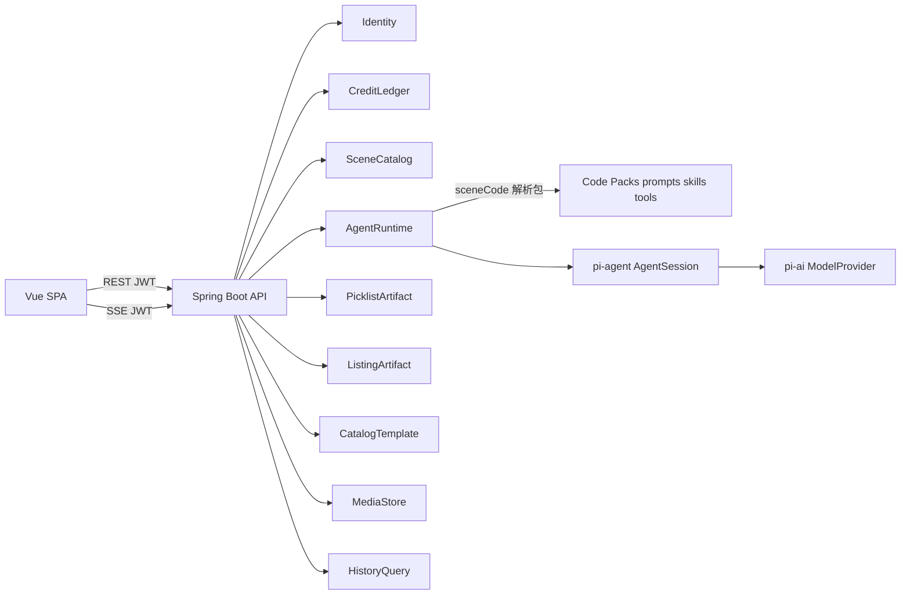

# Architecture Spine — lippi-ai-ebusiness（多场景 + 账户增量）

> **Canonical：** 增量 AD-14..18 已合并进父 Spine  
> `architecture-lippi-ai-ebusiness-2026-09-24/ARCHITECTURE-SPINE.md`。  
> 本文保留作本轮教练决策审计；建造者以父 Spine 为准。

## Design Paradigm

继承 **SPA + API 模块化单体（流式 Agent）**。增量只增加：

- **SceneCatalog**：场景元数据（含灰卡）的唯一写者  
- **SceneCapabilityPack**（代码资源）：按 `sceneCode` 绑定提示词 + skill/tool 白名单  
- **Account HTTP 面**：`/api/v1/account/*`，写资料/改密归 Identity；用量只读归 CreditLedger  



## Inherited Invariants

| Inherited | From parent | Binds here |
| --- | --- | --- |
| AD-1..AD-13 | architecture-lippi-ai-ebusiness-2026-09-24 | 全文有效；本文件不重编号、不削弱 |
| AD-S*（pi-agent-slim） | architecture-pi-agent-slim-2026-09-25 | AgentSession 门面；工具不得写积分；提示词槽位键 allowlist 仍约束，包内容经既有槽位注入 |

冲突时：**先改文档或 course-correction，再合代码**（见 AGENTS.md）。

## Invariants & Rules

### AD-14 — SceneCatalog 所有权 [ADOPTED]

- **Binds:** FR-13..FR-17, UJ-0, UJ-4, SceneCatalog
- **Prevents:** 场景元数据散落在前端常量 / CatalogTemplate / AgentRuntime 多处真相
- **Rule:** **SceneCatalog** 是场景行的唯一写者。每行至少含：`biz_id`、稳定 **`sceneCode`**、展示名、状态（如 `AVAILABLE` / `COMING_SOON`）、排序、可选文案字段。灰卡场景也是真记录（`COMING_SOON`）。**CatalogTemplate** 仍只管品类模板，不表示产品场景。画廊列表 API 只读 SceneCatalog。

### AD-15 — 会话必绑场景；历史可筛 [ADOPTED]

- **Binds:** AgentRuntime, HistoryQuery, FR-12, UJ-0
- **Prevents:** 无场景会话导致错包；历史隔离策略分叉
- **Rule:** 创建计费 Agent 会话 / `GenerationRun` 时 **必须**携带 `sceneId` 或 `sceneCode`（持久化到会话与 run）。历史查询 **默认全球（本人）**，支持按场景筛选；不是「默认仅当前场景」。积分账本仍全站共用（AD-5），不按场景拆账。

### AD-16 — 场景能力包在代码，按 sceneCode 绑定 [ADOPTED]

- **Binds:** AgentRuntime, pi-agent prompt/skill/tool, FR-7, FR-9, FR-16
- **Prevents:** 运营改库即可改提示词导致不可审计；或前端自带提示词
- **Rule:** 提示词包、skill、tool **正文在仓库代码/资源中**（随发版）。SceneCatalog 行通过 **`sceneCode`** 指向包。Application / AgentRuntime 在 `prompt` 前按码加载包并注入 `AgentSession`（遵守 pi-agent 槽位 allowlist）。禁止浏览器下发系统提示词或 tool 定义。电商开店包须覆盖选品 + Listing；灰卡场景可有占位包或空包，但近端不因有包而自动开放（见 AD-18）。

### AD-17 — 账户 API 前缀与职责 [ADOPTED]

- **Binds:** FR-1, FR-2, FR-18, Identity, CreditLedger
- **Prevents:** `/me` 与账户页两套资料模型；账户页开写积分口
- **Rule:** 用户可见账户能力统一挂在 **`/api/v1/account/**`**（资料、用量、改密等）。**邮箱只读**；**显示名可改**；**改密为真接口**（Identity）。**积分用量明细**只读查询由 CreditLedger 提供、经 account 路由暴露。既有 `GET /api/v1/me`、`GET /api/v1/credits` 可保留作兼容或内部聚合，但账户页契约以 `/account` 为准。禁止在 account 下增加结算/改档写口（改档仍走既有 admin / CreditLedger）。

### AD-18 — 未开放场景后端硬拒 [DEFERRED]

- **Binds:** SceneCatalog status, AgentRuntime
- **Prevents:** （后置）绕过前端对 `COMING_SOON` 场景起会话/计费生成
- **Rule（近端）：** **不做**后端硬拒；灰卡闸主要靠 UX。  
- **Rule（后置必补）：** 状态非 `AVAILABLE` 时拒绝创建会话与计费生成（如 403），即使代码包已存在。

### AD-6 增补（所有权表行）[ADOPTED]

在父 Spine AD-6 表追加一行（不改其它行）：

| 所有者 | 写入范围 |
| --- | --- |
| SceneCatalog | 场景元数据（含灰卡）；不写提示词/skill/tool 正文 |

## Consistency Conventions

| Concern | Convention |
| --- | --- |
| 场景键 | 对外/包绑定用稳定 `sceneCode`（如 `ecommerce`）；`biz_id` UUID 对外列表可同时返回 |
| 账户路径 | `/api/v1/account/profile`、`/api/v1/account/password`、`/api/v1/account/credits/usage`（名称可微调，前缀锁定） |
| 包布局 | `[ASSUMPTION]` `classpath` 或模块资源按 `/scenes/{sceneCode}/...`；精确定位发版前钉死 |
| 其余 | 继承父 Spine Conventions |

## Stack

继承父 Spine（Java 8 / Spring Boot 2.7.18 / Vue3 / MySQL / OSS）。本增量不引入新运行时。

## Structural Seed

```text
forma-domain/     # + Scene 聚合/实体（SceneCatalog 所有）
forma-application/# 场景列表查询；建会话校验 scene；加载 pack；account 用例
forma-interfaces/ # /api/v1/scenes*；/api/v1/account/**
…/resources/scenes/{sceneCode}/  # 提示词与 skill/tool 清单（代码包）
APP-META/bootstrap/sql/   # ebus_scene 表种子：四场景行
```

## Capability → Architecture Map

| Capability | Lives in | Governed by |
| --- | --- | --- |
| FR-13..15 场景画廊/灰卡 | SceneCatalog + web | AD-14, AD-18 |
| FR-16 短聊拉回 | 电商 pack 提示词策略 + AgentRuntime | AD-16 |
| FR-17 可扩展形状 | SceneCatalog + pack 目录约定 | AD-14, AD-16 |
| FR-18 账户 | Identity + CreditLedger + `/account` | AD-17 |
| 建会话带场景 | AgentRuntime | AD-15 |
| 历史筛选 | HistoryQuery | AD-15 |
| 选品/Listing | 既有 + ecommerce pack | AD-16 + 父 AD-4/5/7 |

## Deferred

- AD-18 后端硬拒未开放场景（近端明确不做）  
- 删号 API、第三方登录绑定  
- 包目录精确路径与 skill 清单文件格式  
- 运营后台改场景文案/排序（近端可用 SQL 种子 + 发版）  
- 场景包目录精确路径与 skill 清单文件格式  
- 父级 Deferred 项仍有效（支付、SSE 字段表等）；**父 Spine 已合并本增量（2026-09-26 Finalize）**  
