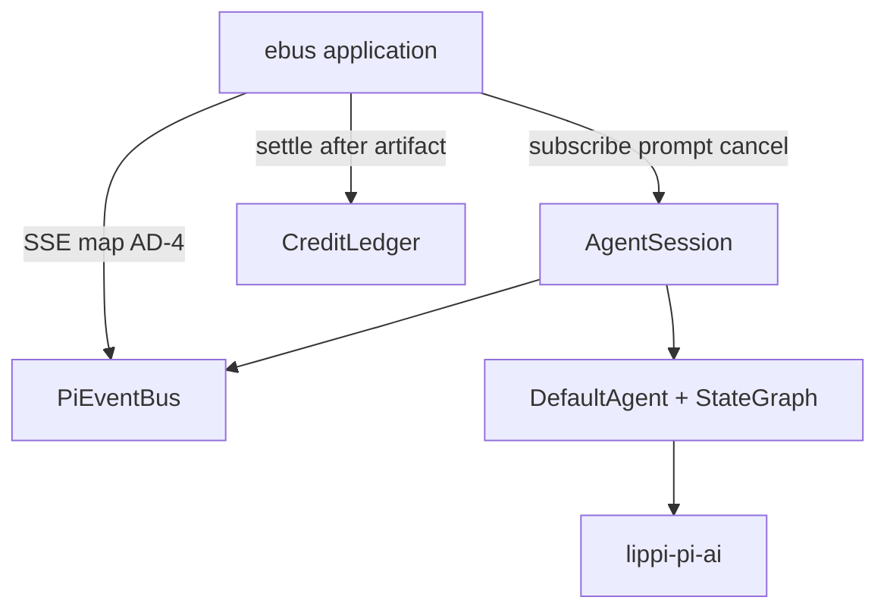
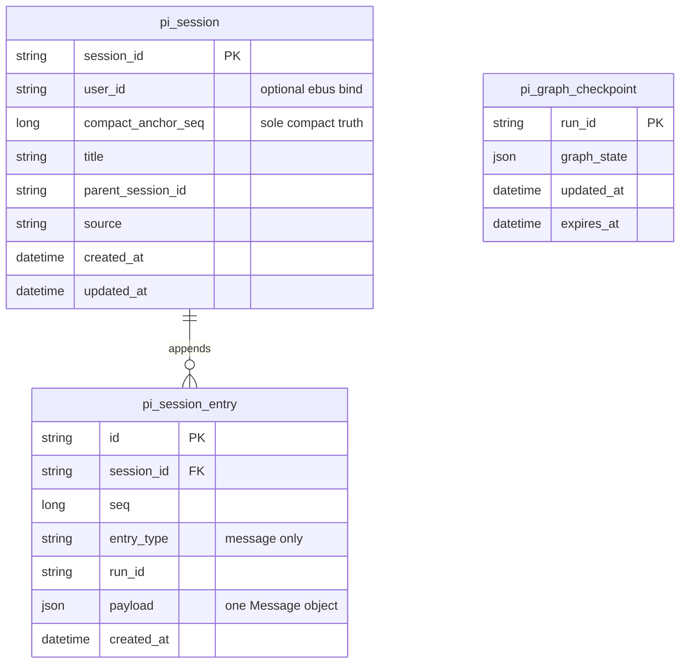
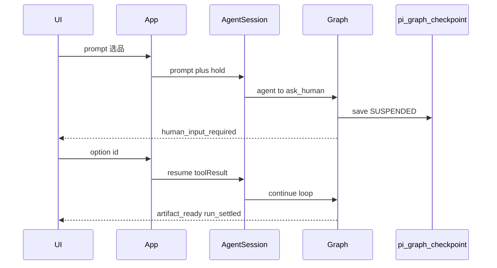

# Architecture Spine — pi-agent-slim

## Design Paradigm

**薄产品门面 + 保留图内 tool-loop**

- 对外仍只有 **`AgentSession`**（subscribe / prompt / cancel；resume 可选）。
- 执行层 **保留** `StateGraph`：`agent ⇄ tools`（本阶段不压成上游 `agentLoop` while）。
- 对齐上游 pi 的是 **行为秩序**（事件可观察、tool 前后钩子、会话与 checkpoint 分家），不是逐行移植 TS core。
- 精简手段：默认关掉重能力、别再扩 SPI；图内核暂不动。
- **Session**：生产 **MySQL**；存储为 pi Entry **混合子集**；≠ Graph Checkpoint。
- **HITL 选品澄清**：`ask_human` 工具中断 + `resume` 续跑；挂起态图 checkpoint 落 **MySQL**（`pi_graph_checkpoint`）。



## Inherited Invariants

| Inherited | From parent | Binds here |
| --- | --- | --- |
| AD-1 客户端边界 | architecture-lippi-ai-ebusiness-2026-09-24 | 浏览器不直连模型 / 不改积分 |
| AD-3 Pi vendor-copy + AgentSession | 同上 | 业务只注入 `AgentSession`；模型只经 `pi-ai` |
| AD-4 SSE 闭合事件名 | 同上 | Pi 事件桥到 AD-4；`artifact_ready`/`run_settled` 仍由 application 发 |
| AD-5 / AD-7 预占结算 | 同上 | **禁止** `AGENT_END` / 流结束当结算点 |
| AD-6 所有权 | 同上 | AgentRuntime 编排；成果与积分不在 Tool 内写 |
| AD-10 MySQL / APP-META | 同上 | Session 表落同一业务 MySQL；**DDL 脚本只进 `APP-META/bootstrap`**（AD-S8） |
| AD-11 依赖方向 | 同上 | infrastructure → 实现端口；pi-agent 不依赖 MyBatis |
| AD-12 UUID | 同上 | `session_id` / entry `id` 为 UUID 字符串 |

## Invariants & Rules

### AD-S1 — 本阶段不拆 StateGraph [ADOPTED]

- **Binds:** `lippi-pi-agent` graph / DefaultAgent
- **Prevents:** 与「删外围噪音」并行再做 while 重写导致双倍回归
- **Rule:** 保留 `START → agent ⇄ tools → END`。允许删未使用的图配置枝节与死代码；**禁止**本阶段将执行核替换为 `agentLoop` 风格 while。若日后要 1A，单独立项，不混进本精简 PR。

### AD-S2 — HITL：ask_human 开；WRITE 审批默认关 [ADOPTED]

- **Binds:** `ask_human`、`AgentSession.resume`、Checkpointer、Tool WRITE 闸
- **Prevents:** 把「问人补信息」做成纯下一回合聊天而丢 tool_result 语义；或默认打开 LIMS WRITE 审批拖垮 Adam
- **Rule:**
  - **Adam 启用** `ask_human` 工具中断 + `resume`（AD-S12 / AD-S13）；与 LIMS **WRITE 人工批准**分离——后者默认 **关**。
  - API 保留：`resume`、Checkpointer、ResumeIdempotency；可选 Redis CP 实现可留树内。
  - Adam **默认 Checkpointer** = **MySQL** 实现（表 `pi_graph_checkpoint`，见 AD-S13）；**不是** No-Op。Redis CP 仅当 `lims.pi.checkpoint.redis.enabled=true` 才可抢 `@Primary`。
  - 计费选品 / Listing：**允许**在成果出现前经历一次或多次 `ask_human`→`resume`；**禁止**把「仅 SSE 流结束 / AGENT_END」当结算；settle 仍仅在可用成果落库后（父 AD-5）。
  - 会话历史真相仍是 Session transcript（AD-S3）；Checkpointer **只**服务挂起 run 的图状态，不作 FR12 历史源。

### AD-S3 — Session 持久化：MySQL + pi Entry 结构 [ADOPTED]

- **Binds:** `SessionStore`、Adam 会话 transcript、AgentRuntime
- **Prevents:** cwd SQLite 当生产真相；扁平「整表 messages blob」与上游 pi 会话模型分叉；Session 与 Graph Checkpoint 混存
- **Rule:**
  - **生产默认**：`SessionStore` 的 MySQL 实现（共享 APP-META / 业务 MySQL）。端口仍在 `lippi-pi-agent`；**适配器**在 `lippi-ai-ebus-infrastructure`（MyBatis），`@Primary`；`pi-agent` **不**依赖 MyBatis。
  - **逻辑形状**：上游 pi SessionTree/Entry **灵感** + 本仓现有 `SessionStore` 语义；**可执行细则以 AD-S6..S8、AD-S11 为准**（勿自行发明「Part 2 全量」实现）。
  - **≠ Checkpointer**：禁止与 `pi:checkpoint:` / Graph 状态共用表或键空间。
  - **本阶段单 lane**；多 lane / Operation SM → Deferred。
  - 用户维度（FR12）：见 **AD-S11**（application ACL；适配器默认不静默按 user 过滤）。

### AD-S4 — 三段 Prompt，allowlist 键注入 [ADOPTED]

- **Binds:** `PromptBuilder`、`SystemPromptInput`
- **Prevents:** 三不透明字符串 vs 自由 maps 双协议；Hermes 键继续膨胀
- **Rule:** 见 **AD-S10**（冻结线型）。保留 stable / context / variable 三槽；**唯一**组装器为 `SystemPromptInput.format` / `PromptBuilder`；节点与 application **禁止**另拼 system。

### AD-S5 — 精简范围边界 [ADOPTED]

- **Binds:** 本 feature 所有 PR
- **Prevents:** 「精简」滑成全模块重写或误删业务仍依赖的面
- **Rule:** 本阶段 **显式不动**：Skill 平台、斜杠命令、LIMS 内置 skill 资源（可不清目录，但不作为删除目标）。允许的噪音清理：未引用配置、重复门面、默认装配路径、文档与命名漂移（ConversationLoop→Agent 等）。结算与 AD-4 终态事件仍在 **ebus application**，不迁入 pi-agent Tool。

### AD-S6 — Entry 粒度：一行一 Message [ADOPTED]

- **Binds:** MySQL `pi_session_entry`、MysqlSessionStore
- **Prevents:** 「一行一消息」vs「一行一整批 append」双 DDL
- **Rule:** **1 Entry 行 = 1 条 `Message`**。`payload` = **单个** Message JSON 对象（非数组、非 envelope）。本阶段 `entry_type` **仅允许** `message`（compact 后的可选 summary 也是 `message`）。`parent_id` 本阶段 **恒为 null / 忽略**（单 lane，不做 message 树边）。`UNIQUE(session_id, seq)`。

### AD-S7 — Compaction 唯一协议 [ADOPTED]

- **Binds:** `setCompactAnchor`、`load`
- **Prevents:** meta 列 vs `entry_type=compaction` 双真相
- **Rule:** 压缩锚点 **只**存在于 `pi_session.compact_anchor_seq`。`load` = `seq > compact_anchor_seq` 且 role≠system。可选：`setCompactAnchor` 时追加一条 summary **`message` Entry**。本阶段 **禁止** `entry_type=compaction` 协议。

### AD-S8 — SessionStore 端口冻结与 DDL / Bean [ADOPTED]

- **Binds:** `SessionStore` API、APP-META SQL、Adam starter 装配
- **Prevents:** 端口改成 Entry API 与 Message 投影并行；迁移表名分叉；MissingBean 落盘 Sqlite
- **Rule:**
  - 本阶段 **冻结** 现有 Message 投影端口（`load`/`append`/`getOrCreate`/…）；Entry 仅为 **适配器私有** 编码，**禁止**把 Entry 提升为公共端口类型。
  - DDL **唯一所有者**：`APP-META/bootstrap` SQL（或仓库既定 bootstrap 路径）；表名锁定 **`pi_session`** / **`pi_session_entry`**（小写）；禁止并行发明 `session` / `PI_SESSION` 等别名迁移。
  - Adam/ebus 运行 profile：**禁止**注册生产 `SqliteSessionStore` `@Bean`；无 MySQL 适配器时 MissingBean → **失败启动或 InMemory**，**永不**静默落到工作目录下的 `.lippi-pi/state.db`。Sqlite 仅 `test` scope / 显式 test 配置。

### AD-S9 — Session vs Checkpoint 职责边界 [ADOPTED]

- **Binds:** Checkpointer vs Session、crash / 挂起后续跑
- **Prevents:** CP 与 Session 双真相叠加工具结果；把 CP 当聊天历史
- **Rule:**
  - **对话历史 / FR12 / compact** → 仅 Session（`pi_session*`）。
  - **同一 run 内 ask_human 挂起→resume** → 图状态仅 Checkpointer（`pi_graph_checkpoint`）；resume 注入 tool result 后继续，成功/失败终态删除该 run 的 CP（SUSPENDED 保留）。
  - 进程崩溃且 **无**挂起 CP：下一轮只能 `prompt` + Session `load`，不得假装 resume。
  - 进程崩溃且存在 SUSPENDED CP：允许 `resume`（带用户已答或客户端重放答案）；禁止同时从 CP 与 Session「再执行一遍」同一 tool 副作用（幂等见 ResumeIdempotency + append runId）。

### AD-S10 — Prompt 注入线型冻结 [ADOPTED]

- **Binds:** `SystemPromptInput`、`ContextOverwrite`、`before_agent_start`
- **Prevents:** 三不透明 blob vs 自由 named maps 半迁移
- **Rule:** 采用 **现有三槽 `Map<String,String>` + 键 allowlist**（与 `SystemPromptInput` 常量一致：`soul`/`skills`/`tools`/`core`/`agents`/`hermes`/`context`/`memory`/`user`/`before_agent_start`；**本阶段禁止新增键**，含禁用新 `contribution` SPI）。调用方写入的是各键的 **字符串值**。`ContextOverwrite` **只追加**到已有槽位的 allowlist 键（典型 `before_agent_start`）。基槽填充：application / `before_agent_start` 增量；**唯一** format 出口。

### AD-S11 — 列表 ACL、元数据下限、append 幂等 [ADOPTED]

- **Binds:** `listRecent`、FR12、`append` 幂等、`getOrCreate` meta
- **Prevents:** 适配器静默按 user 过滤；meta 最小集分叉；runId 幂等粒度分叉
- **Rule:**
  - `listRecent` **不得**因 ThreadLocal/隐式 user 在适配器内过滤；FR12「仅本人」由 **application** 显式传 `userId`（扩展端口参数或应用侧会话索引表）完成。
  - `pi_session` 本阶段必填列：`session_id`、`created_at`、`updated_at`、`compact_anchor_seq`（默认 0）；可选：`user_id`、`title`、`parent_session_id`、`source`（默认 `api`）。
  - `append(sessionId, runId, messages)` 幂等 = 该 session 下若 **已存在任一** 同 `run_id` 的 entry → **整批跳过**（禁止按 message id 部分去重）。

### AD-S12 — `ask_human` 工具（选品澄清） [ADOPTED]

- **Binds:** Adam 选品（及同类）信息不足场景、Tool 目录、SSE
- **Prevents:** 用 WRITE 审批冒充问人；或只用自然语言问句无结构化选项导致前后端分叉
- **Rule:**
  - 提供一等工具 **`ask_human`**：入参至少 `question: string`、`options: [{id, label}]`，可选 `allowFreeText: boolean`。
  - 调用后走 ToolNode **HITL 挂起**（`needsHitl`），**不**执行外部副作用；interrupt payload 含 `toolCallId`、`question`、`options`。
  - **≠** `ToolLevel.WRITE` 审批：`ask_human` 用独立策略（如 `ToolLevel.HUMAN` 或专用 before_tool 分支）；Adam 默认不要求 WRITE 批准。
  - SSE：应用层发出闭合事件 **`human_input_required`**（已写入父 Spine AD-4）；payload 含 `runId`、`sessionId`、`toolCallId`、`question`、`options`。禁止另造同义事件名。
  - 积分：挂起期间 **保持预占**；不因 `human_input_required` 结算或释放（除非用户取消 run → 释放 hold）。

### AD-S13 — 挂起续跑与 MySQL 图 Checkpoint [ADOPTED]

- **Binds:** `AgentSession.resume`、MysqlCheckpointer、选品/Listing agent-loop
- **Prevents:** 无耐久 CP 导致跨请求丢失工具中断态；Redis 成为 Adam 默认依赖
- **Rule:**
  - 用户提交答案 → application 调 **`AgentSession.resume`**：将选择/自由文本写入对应 `toolCallId` 的 **tool result**，重跑 `tools` 节点 → 继续 `agent ⇄ tools` 直至结束或再次 `ask_human`。
  - Checkpointer 生产默认：**MySQL** 表 **`pi_graph_checkpoint`**（DDL 仅 `APP-META/bootstrap`；键空间按 `runId`；**禁止**与 `pi_session*` 混表）。适配器在 ebus-infrastructure；端口仍在 pi-agent `Checkpointer`。
  - `ResumeRequest` 建议带 `confirmRequestId` 做幂等；同答重放不双写工具副作用。
  - 同一计费 GenerationRun / hold 跨越 HITL；多次 ask/resume 仍是 **一次**预占，直至成果落库结算或失败释放。
  - 前端：SSE 断线后可用 `runId` 查询挂起态并再次订阅；答案走 REST/SSE 控制通道调 resume，不新开「假 prompt」冒充续跑（除非 AD-S9 崩溃无 CP 降级）。

## Consistency Conventions

| Concern | Convention |
| --- | --- |
| 门面 | 业务只注入 `AgentSession`；不注入 `DefaultAgent` / GraphExecutor |
| 默认 Bean | SessionStore→MysqlSessionStore；Checkpointer→**MysqlCheckpointer**；Redis CP 仅显式属性 |
| Session 表 | `pi_session` + `pi_session_entry`；DDL 仅 APP-META bootstrap；1 row = 1 Message |
| Graph CP 表 | `pi_graph_checkpoint`（按 runId；≠ session 表） |
| HITL | `ask_human` + resume；WRITE 审批默认关；SSE `human_input_required` |
| Compaction | 仅 `compact_anchor_seq`；无 `entry_type=compaction` |
| Prompt | 三槽 allowlist 键；`ContextOverwrite` 只追加；唯一 format |
| 事件 | Pi 枚举 + ebus 映射；AD-4 含 `human_input_required` |
| 对齐上游 | 行为对齐 events+tool hooks；Session 为 pi Entry **混合子集** |
| ID | UUID 字符串（AD-12） |
| 文档漂移 | 去掉「Session 不做 MySQL」旧注释 |

## Stack

| Name | Version / pin |
| --- | --- |
| Java / Spring Boot | 继承父 Spine（Java 8 + Boot 2.7.18） |
| MySQL | APP-META compose **`mysql:8.0.36`**（继承父 AD-10） |
| MyBatis | ebus infra 既有（parent POM mybatis-spring-boot 2.3.x / mybatis 3.5.x） |
| lippi-pi-ai Message JSON | 本仓 `Message` 序列化；不另引第二套 |

## Structural Seed

```text
lippi-pi-agent/
  session/     # AgentSession + SessionStore（Message 端口）；InMemory 测；Sqlite 仅 test
  agent/       # DefaultAgent + PromptBuilder（三槽 allowlist）
  graph/       # StateGraph 保留；默认 InMemory/No-Op CP
  event/       # PiEventBus
  extension/   # 保留；Adam 默认不依赖 WRITE HITL
  tool/ skill/ # 本阶段不删平台

lippi-ai-ebus-infrastructure/
  …/session/       # MysqlSessionStore → @Primary
  …/checkpoint/    # MysqlCheckpointer → @Primary（Adam 默认）

APP-META/bootstrap/
  …                # DDL：pi_session / pi_session_entry / pi_graph_checkpoint
```





## Deferred

- **压成上游 while-loop（原选项 1A）**：等 Adam 主路径稳定且有回归套后再议。
- **Skill / 斜杠精简（原选项 5）**：本阶段不动。
- **LIMS WRITE 审批 HITL**：保持默认关；需要时另开配置，不与 `ask_human` 混用同一 UI。
- **Redis Checkpointer**：可选；Adam 默认 MySQL CP（AD-S13）。
- **pi Session 全量**：多 lane、`parent_id` 树边、Operation SM。
- **三不透明字符串 Prompt**：若弃 maps，单独立项替换 AD-S10。
- **父 Spine AD-4 payload 细表**：事件名已含 `human_input_required`；字段 JSON 可后钉。
- **抽 `lippi-pi-*` 跨仓共享库**：仍遵父 Spine Deferred。
